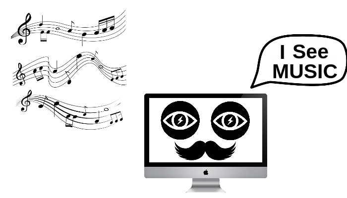
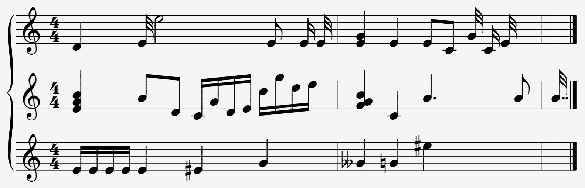
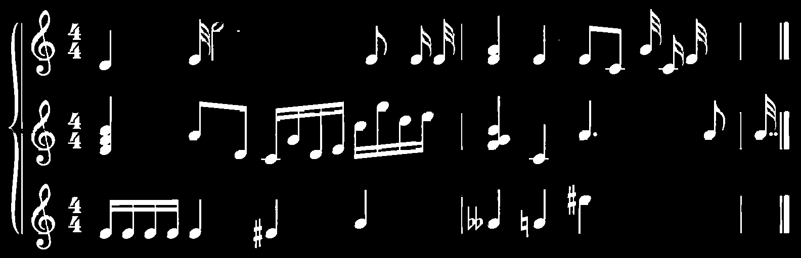
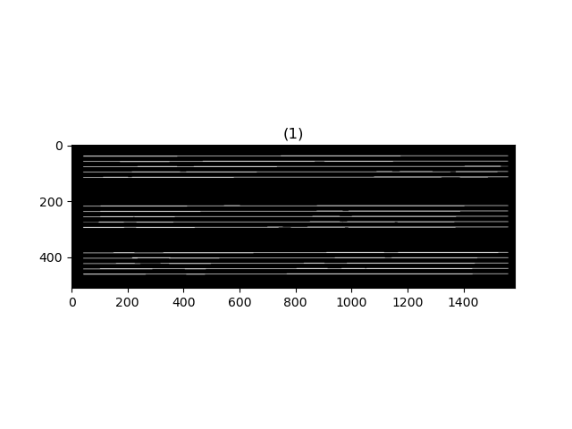
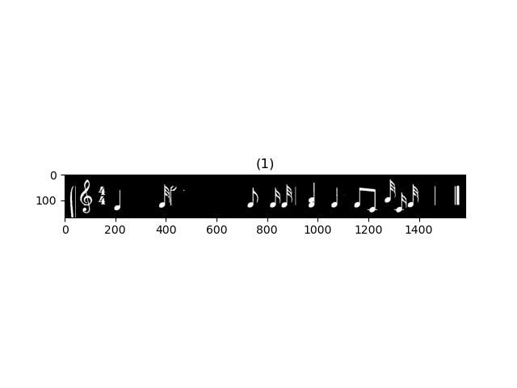
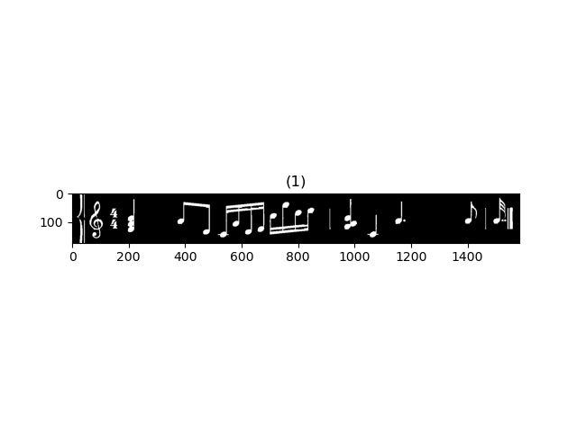
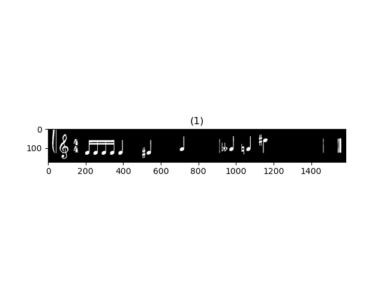

# :musical_score: Read That Note

 

  
  
  
  
  
  
  
  
  
  

### Read That Note is an optical musical recognition system, where the input is a musical sheet score, and the output is a text representing each note and symbol

## methodology

<ol>
<li>Deskewing the Image</li>
<li>Convert Image To Binary</li>
<li>Remove Staff Lines</li>
<li>Remove Musical Notes</li>
<li>Extract Each 5 Staves Together</li>
<li>Musical Note Segmentation</li>
<li>Remove Unwanted labels</li>
<li>Classify Musical Note</li>
<li>Convert Line Array To Usable Data</li>
<li>Output To File</li>
</ol>

### for more details on the used algorithm please follow this link: <a href="https://github.com/bahaaEldeen1999/Read-That-Note/tree/main/methodology">Methodology</a>

## Experiment

### input

### staff line removel

### staff lines without musical notes

### sine segmentation

### character segmentation

 

 

### output

<h3>
{ 
[ \meter<"4/4"> d1/4 e1/32 e1/8 e1/32 e1/32{e1/4,g1/4}  e1/4 e1/16 c1/16 g1/32 c1/4 e1/32], 
[ \meter<"4/4">{b1/4,e1/4,g1/4}  a1/8 d1/8 c1/16 g1/16 d1/16 e1/16 c2/16 g2/16 d2/16 e2/16{b1/4,f1/4,g1/4}  c1/4 a1/4 a1/8 a1/32], 
[ \meter<"4/4"> e1/16 e1/16 e1/16 e1/16 e1/4 e#1/4 g1/4 g&&1/4 g1/4 e#2/4] 
}
</h3>
